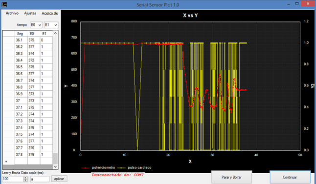
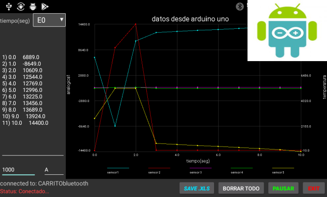

# Serial-Graph-Sensor [Windows - Android]
Plot Serial Sensor Arduino visual C# "Visual studio"
Creado para liberar servicio social para el laboratorio de fenómenos colectivos de la facultad de ciencias UNAM.

### ------------- proximas Implementaciones .   ---------------------------------------
- Envio de datos usando cable OGT-USB de "arduino uno" a android
- Envio de datos a url especificada por POST usando formato JSON

Este software es una versión para Windows funcional en Xp,win7,win8,win10 y Android. quizá en Xp sea necesario instalar .net framework 4.5. 
Para el guardado en Excel requiere de al menos tener instalado office 2003 o superior. Este proyecto usa las librería “Zedgraph” 
para los paneles de graficado.
Su objetivo es la recepción y graficado de datos vía serial de un arduino (o microchip) con sensores de temperatura presión, campo 
magnético etc…  La intención es que se grafique en tiempo real estos datos. Los datos enviados desde el micro controlador ya sea
arduino o microchip deben venir en una sola cadena separados por espacios. Pueden ser enviados desde 1 hasta 9 datos.
Ejemplo: “3.45 5.0 4.56 23.45 ” aquí hay 4 datos  que llamamos E0,E1,E2,E3 etc…. Ha funcionado muy bien para lecturas cada 100ms menos a esto provoca errores.
Los datos se envían ya sea por cable USB-serial o por bluetooth usando los módulos HC-05 y Hc-06.

###  ------------  Características de Software   --------------------------------
* Ajuste de Colores fondo, cuadricula leyendas
* Títulos de ejes
* escalado automático o fijo
* colores de las graficas
* datos unidos por línea o solo puntos, tamaño de puntos.
* autoguardado de ajustes
* muestra hasta 6 graficas en dos paneles distintos,
* dos ejes Y1, Y2 (derecho izquierdo) configurables.
* Paro automático después de determinados puntos obtenidos, útil para tomar temperaturas o datos por largos tiempos.
* guardado de datos en Excel, guardado de la imagen del gráfico.
* visualización de los datos en tiempo real 

###  ------------  Proximas mejoras   --------------------------------
* Conexion directa de Arduino por USB-OGT en android (ya implementado revisa Manual)
* mejoras a la intefaz de usuario para windows y android 
* envio de datos a Server por Post, los datos se enviaran en formato Json desde la app de android.
 

### uso del codigo fuente
    solo descarga el proyecto descomprimelo, el codigo fuente esta dentro de la carpeta "labcof" entra y abrelo con visual studio 2010-2017. si te marca error al compilar, quisa sea necesario que agregues la libreria zedgraph.dll  
### usar el software
    descargar el proyecto descomprimelo, el programa listo para usar esta en la carpeta "programa" ahi dentro hay un manual que te guiara paso a paso. 

  Se anexa un manual rápido en pdf.
link youtube muestra su funcionamiento
1. https://www.youtube.com/watch?v=L1fVNvopPco

si este software te sirvio, contribuye a mi trabajo adquiriendo la version para Android. https://play.google.com/store/apps/details?id=com.troyasoft.pro.serialplot

