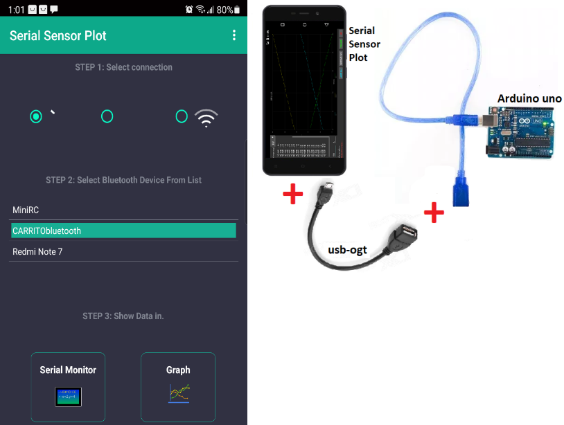

# Serial-Sensor-Plot [Windows - Android]
Serial Sensor Plot Creado para graficar datos que se reciben por el puerto serie usando el protocolo rs232. en windows y android

Este software es una versión para Windows funcional en Xp,win7,win8,win10 y Android. quizá en Xp sea necesario instalar .net framework 4.5. El código fuente solo esta disponible en c#, para android no esta disponible solo la aplicacion en googleplay.

Para el guardado en Excel requiere de al menos tener instalado office 2003 o superior. Este proyecto usa las librería “Zedgraph” 
para los paneles de graficado.
Su objetivo es la recepción y graficado de datos vía serial de un arduino (o microchip) con sensores de temperatura presión, campo 
magnético etc…  La intención es que se grafique en tiempo real estos datos. Los datos enviados desde el micro controlador ya sea
arduino o microchip deben venir en una sola cadena separados por espacios. Pueden ser enviados desde 1 hasta 9 datos(vesion para windows) y de 1 hasta 5 (version para Android).
Ejemplo: “3.45 5.0 4.56 23.45 ” aquí hay 4 datos  que llamamos E0,E1,E2,E3 etc…. Ha funcionado muy bien para lecturas cada 100ms menos a esto puede provoca errores tanto en Windows como en Android.
Los datos se envían ya sea por cable USB-serial o por bluetooth usando los módulos HC-05 y Hc-06. 

Todo el proceso de configuración para Windows y Android se describe en el Manual.pdf

###  ------------  Características de Software  para Windows --------------------------------
* Ajuste de Colores fondo, cuadricula leyendas
* Títulos de ejes
* escalado automático o fijo
* colores de las graficas
* datos unidos por línea o solo puntos, tamaño de puntos.
* autoguardado de ajustes
* muestra hasta 6 graficas en dos paneles distintos,
* dos ejes Y1, Y2 (derecho izquierdo) configurables.
* Paro automático después de determinados puntos obtenidos, útil para tomar temperaturas o datos por largos tiempos.
* guardado de datos en Excel, guardado de la imagen del gráfico.
* visualización de los datos en tiempo real 

###  ------------  Características de la App  para Adroid --------------------------------

* Ajuste de Colores de la 5 graficas
* Títulos de ejes
* escalado automático
* autoguardado de ajustes
* muestra hasta 5 graficas
* dos ejes Y1, Y2 (derecho izquierdo) configurables.
* Paro automático después de determinados puntos obtenidos, útil para tomar temperaturas o datos por largos tiempos.
* guardado de datos en Excel.
* conexión de arduino via bluetooth o USB-OTG. se ha probado en arduino one, mega, nano, y para los dispositivos CP210X, CDC, FTDI, PL2303, CH34x, CP2130 SPI-USB. 

 

### uso del codigo fuente
    solo descarga el proyecto descomprimelo, el codigo fuente esta dentro de la carpeta "labcof" entra y abrelo con visual studio 2010-2017. si te marca error al compilar, quisa sea necesario que agregues la libreria zedgraph.dll al proyecto, la libreria esta dentro de la carpeta bin.  
### usar el software
    descargar el proyecto descomprimelo, el programa listo para usar esta en la carpeta "Programa Para Windows" ahi dentro hay un manual que te guiara paso a paso. 
 
link youtube muestra su funcionamiento
1. https://www.youtube.com/watch?v=L1fVNvopPco

Si este software te sirvio, contribuye a mi trabajo adquiriendo la App para Android. esto me motiva a seguir desarrollando SOFTWARE LIBRE. https://play.google.com/store/apps/details?id=com.troyasoft.pro.serialplot

